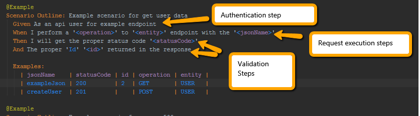
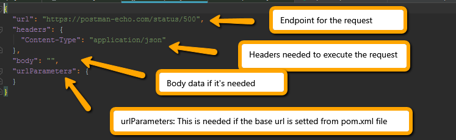

# LIPPIA API Example Project

## System Requirements : 
+ git client: https://www.atlassian.com/git/tutorials/install-git 
+ docker 18.09: https://docs.docker.com/install/linux/docker-ce/ubuntu/ 
+ docker compose 1.24: https://docs.docker.com/compose/install/

## Docker stack

The following project includes the basic Docker Lippia Containers to run this  web sample project. You can choose to run the code from your favourite IDE, run from console or from Jenkins using the Docker Stack.
To install and start a local instalation with Docker containers go to **Getting started** at the end of this guide. 

# Purpose: 

The following project has the purpose of demonstrate and let test automation developers to to test API requests using Lippia Automation Framework based on Rest Client library. 
This sample project includes the required components as binaries, docker containers and configuration files to simply download and run a set of sample tests in your local computer, using the Lippia container stack described bellow.

# Getting started

## Executing tests in you local machine 
- go to root project folder and you will find a pom.xml file
- run the following command : 
```
sudo docker-compose -f docker-compose.yml up --abort-on-container-exit --exit-code-from lippia
```
	
## Project structure

A typical Lippia Test Automation project usually looks like this 

```
	.
├── main
│   ├── java
│   │   └── com
│   │       └── crowdar
│   │           └── api
│   │		 └── config
│   │ 	         |    └── EntityConfiguration.java
│   │            └── model
│   │               │   └── Data.java
│   │               │   └── ResponseHeaders.java
│   │		    │	└── User.java
│   │               │   └── UserCreated.java
│   │               │   └── Users.java
│   │               └── services
│   │                   └── ResponseHeadersService.java
│   │                   └── UserService.java
│   └── resources
│       ├── config.properties
│       ├── cucumber.properties
│       └── log4j.properties
└── test
    ├── java
    │   ├── ApiExampleProjectParallelTestRunner.java
    │   ├── ApiExampleProjectTestRunner.java
    │   └──
	└── steps	
	│   └── ResponseHeadersSteps.java
	│   └── UserSteps.java
	└── apiExampleProject
    │           └── Hooks.java
    └── resources
        └── features
            └── ApiExample.feature
		└── jsons
	└── jsons
            └── request
	    	└── createUser.json
		└── errorRequest.json
		└── exampleJson.json
		└── responseHeadersRequest.json
	    └── response
	    	└── responseHeadersResponse.json
```

Folder's description:

|Path   |Description    |
|-------|----------------|
|main\java\\...\examples\model\\\*.java|Folder with all the **Mapped Objects** matching steps with java code|
|main\java\\...\examples\config\\\*Steps.java|Folder with all the **Settings** wich match with Gherkin Test Scenarios |
|test\resources\features\\\*.feature|Folder with all the **feature files** containing **Test Scenarios** and **Sample Data** |
|test\resources\request\\\*.json|Folder with all the **json files** containing **Request** data |
|test\resources\response\\\*.json|Folder with all the **json files** containing **Response** data if necessary|
|main\resources|Folder with all configuration needed to run Lippia |

In this example, *ApiExample* is the first endpoint the framework will interact with. The **steps** defined in *UserSteps.java* to execute the *Test Scenarios* defined in Gherkin language. 


|File   | Description    |
|-------|----------------|
|User.java   | Model: you can declare every attribute expected on the responses that you want to interact with. You need to add one new file for each response you want to model in your tests. |
|UserSteps.java   | StepOpject: Code to support the behaviour of each **step** coded into the feature files for the *User* endpoint. This code executes the interaction between the Framework and the api endopoint and match the steps with the code who run interactions. |
|ApiExample.feature| Feature file: Definition of the **Test Scenarios** with all the **steps** written in Cucumber format (http)|


### Model Object Example

In the model examples you can mapped the expected objects from different api responses. We can show you a little example:

```
{
    "data": {
        "id": 2,
        "email": "janet.weaver@reqres.in",
        "first_name": "Janet",
        "last_name": "Weaver",
        "avatar": "https://s3.amazonaws.com/uifaces/faces/twitter/josephstein/128.jpg"
    }
}

```
So the model class will be something like this: 
```
   public class User {

    @JsonProperty("id")
    private int id;
    @JsonProperty("email")
    private String email;
    @JsonProperty("first_name")
    private String first_name;
    @JsonProperty("last_name")
    private String last_name;
    @JsonProperty("avatar")
    private String avatar;

    public int getId() {
        return id;
    }
    public void setId(int id) {
        this.id = id;
    }
    public String getEmail() {
        return email;
    }
    public void setEmail(String email) {
        this.email = email;
    }
    public String getFirst_name() {
        return first_name;
    }
    public void setFirst_name(String first_name) {
        this.first_name = first_name;
    }
    public String getLast_name() {
        return last_name;
    }
    public void setLast_name(String last_name) {
        this.last_name = last_name;
    }
    public String getAvatar() {
        return avatar;
    }
    public void setAvatar(String avatar) {
        this.avatar = avatar;
    }
	}

The idea is have one attribute per field to map on the response


# Lippia Architecture	


# Scenario Example




The scenarios can be written using BDD methodology. 
	
	Given as a precondition
	
	When as actions
	
	Then as validations
	
	
On each declared step you can insert the calls defined from service classes

# Json Structure for request data

This project use json to manage request data like url parameters, body data, headers and url endpoints. The following picture shows the structure of the json




# Getting started
    
- If you are Linux user 
    [`Getting started - Linux User`](docs/README_Linux.md)
- If you are Windws user
    [`Getting started - Windows User`](docs/README_Windows.md)

## Project type options:
- The project type option allows the user to say Lippia which library would need to download. For this project is setted the API one that only have all library needed for this kind of project.
  This option can be changed in the pom.xml file
  You can get more information checking the readme file from lippia-core project.
  
  API
        crowdar.projectType=API