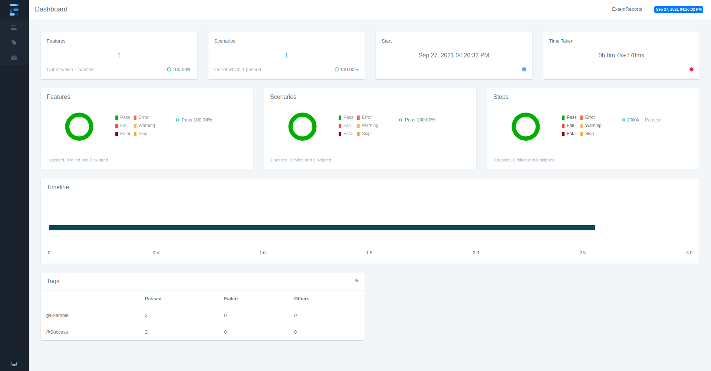
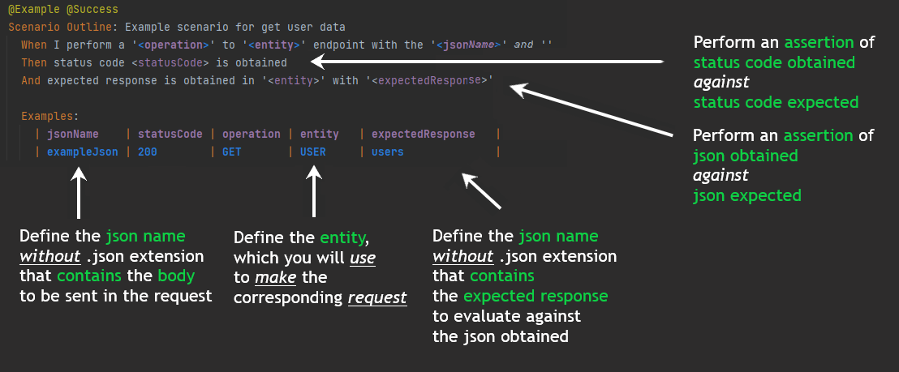
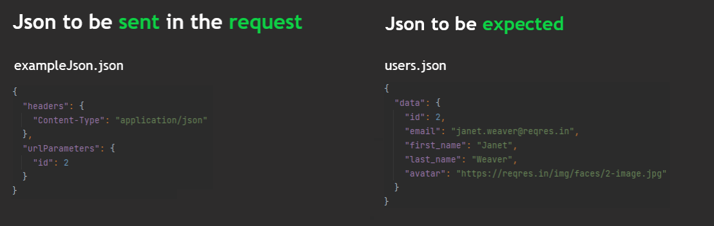
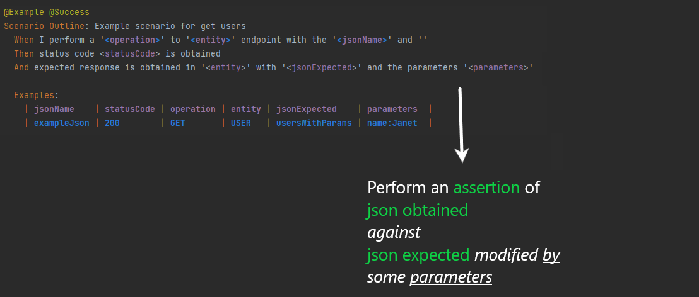
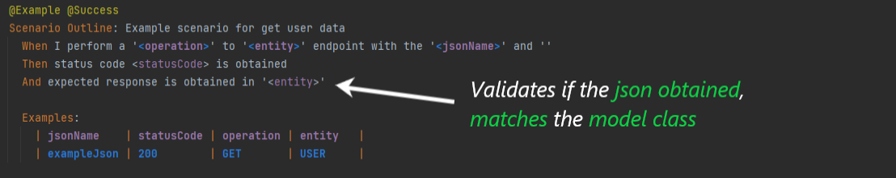
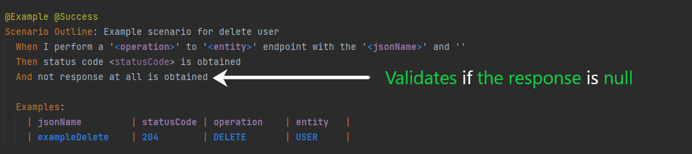
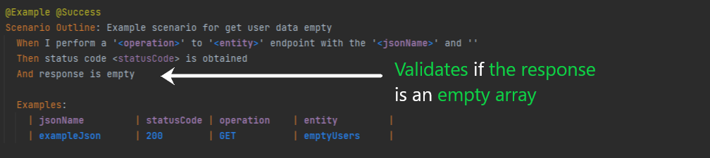

# LIPPIA API Example Project

# Purpose
The following project has the purpose of demonstrate and let test automation developers to test API requests by using Lippia Automation Framework based on Rest Client library. 
This sample project includes the required components as binaries, docker containers and configuration files to simply download and run a set of sample tests in your local computer, using the Lippia container stack.

## System Requirements: 
+ JDK: https://docs.oracle.com/en/java/javase/index.html 
+ Maven: https://maven.apache.org/download.cgi 
+ Git client: https://www.atlassian.com/git/tutorials/install-git 
+ Docker 18.09+: https://docs.docker.com/install/linux/docker-ce/ubuntu/  _OPTIONAL_ 
+ Docker compose 1.24+: https://docs.docker.com/compose/install/ _OPTIONAL_

# Getting started

- Running only with Maven [`Getting started - Running only with Maven`](docs/README_Maven.md)
- Running with Docker [`Getting started - Running with Docker`](docs/README_Docker.md)
	
# Reports[](url)

We believe that the reports should express the results of our tests in the most legible, detailed and pleasant way possible, so that in this way, our clients have at their disposal a report on the operation and behavior of their product, as well as the performance of the team. That is why Lippia, in addition to supporting the integration with **ExtentReport**, provides a **ReportServer** for each client.   
Next, we will see the structure of the project and from where we can access them.

### Reports are generated in the folder called **target**, which will be generated once the execution of the test suite is finished.   
Note that the following structure is part of the report generated with ExtentReport library.
```
├── lippia-api-sample-project
|   ├── docs
|   |   └── ...
|   ├── src
|   |   └── ...
│   ├── target
│   |   └── reports
|   |       └── index.html
|   └── ...
```

### Graphic example   



## Project structure

A typical Lippia Test Automation project usually looks like this 

```
	.
├── main
│   ├── java
│   │   └── com
│   │       └── crowdar
│   │           └── api
│   │		 └── config
│   │ 	         |    └── EntityConfiguration.java
│   │            └── model
│   │               │   └── Data.java
│   │               │   └── ResponseHeaders.java
│   │		    │	└── User.java
│   │               │   └── UserCreated.java
│   │               │   └── Users.java
│   │               └── services
│   │                   └── ResponseHeadersService.java
│   │                   └── UserService.java
│   └── resources
│       ├── config.properties
│       ├── cucumber.properties
│       └── log4j.properties
└── test
    ├── java
    │   ├── ApiExampleProjectParallelTestRunner.java
    │   ├── ApiExampleProjectTestRunner.java
    │   └──
	└── steps	
	│   └── ResponseHeadersSteps.java
	│   └── UserSteps.java
	└── apiExampleProject
    │           └── Hooks.java
    └── resources
        └── features
            └── ApiExample.feature
		└── jsons
	└── jsons
            └── request
	    	└── createUser.json
		└── errorRequest.json
		└── exampleJson.json
		└── responseHeadersRequest.json
	    └── response
	    	└── responseHeadersResponse.json
```

Folder's description:

|Path   |Description    |
|-------|----------------|
|main\java\\...\examples\model\\\*.java|Folder with all the **Mapped Objects** matching steps with java code |
|main\java\\...\examples\config\\\*Steps.java|Folder with all the **Settings** wich match with Gherkin Test Scenarios |
|test\resources\features\\\*.feature|Folder with all the **feature files** containing **Test Scenarios** and **Sample Data** |
|test\resources\request\\\*.json|Folder with all the **json files** containing **Request** data |
|test\resources\response\\\*.json|Folder with all the **json files** containing **Response** data if necessary |
|main\resources|Folder with all configuration needed to run Lippia |

In this example, *ApiExample* is the first endpoint the framework will interact with. The **steps** defined in *UserSteps.java* to execute the *Test Scenarios* defined in Gherkin language. 


|File   | Description    |
|-------|----------------|
|User.java   | Model: you can declare every attribute expected on the responses that you want to interact with. You need to add one new file for each response you want to model in your tests. |
|UserSteps.java   | StepOpject: Code to support the behaviour of each **step** coded into the feature files for the *User* endpoint. This code executes the interaction between the Framework and the api endopoint and match the steps with the code who run interactions. |
|ApiExample.feature| Feature file: Definition of the **Test Scenarios** with all the **steps** written in Cucumber format (http)|

## Project type options:
- The project type option allows the user to say Lippia which library will need to download. For this project is set the API one that only have all library needed for this kind of project.
  This option can be changed in the pom.xml file   
  You can get more information checking the README file from lippia-core project.
  
```
├── config.properties
        ├── base.api.url = urlBase
        |   └── This option allows the user to say Lippia which urlBase would need to perform requests
        |
        ├── crowdar.projectType = API
        |
        └── crowdar.api.entityConfiguration = api.config.entityConfiguration
            └── This option allows the user to say Lippia where to look for the defined constants or entities
                (note that java folder is ignored, the path must be specified from the java child folder)
```

# Json Structure for request data

This project use json to manage request data like url parameters, body data, headers and url endpoints. The following picture shows the structure of the json


## Runners
***
```
├── lippia-api-sample-project
│   ├── docs
│   │   └── ...
│   ├── src
│   │   ├── main
│   ├── java
│   │     └── ...
│   ├── resources 
│   │     └── ...
│   ├── test
│   │     ├── resources
│   │     │ └── ...
│   │ 
│   ├── pom.xml
│   ├── testngParalell.xml
│   ├── testng.xml
│          
│  
```

The test cases are executed using **TestNG** class. This class is the main entry point for running tests in the TestNG framework. By creating their own TestNG object and invoke it on a testng.xml.

|**Attribute** | **Description** | 
|--------------|-----------------| 
|name   | The name of this suite. It is a **mandatory** attribute. |  
|verbose   | Whether TestNG should run different threads to run this suite. |  
|parallel   | Whether TestNG should run different threads to run this suite. |
|thread-count   | The number of threads to use, if parallel mode is enabled (ignored other-wise). |  
|annotations   | The type of annotations you are using in your tests. |  
|time-out   | The default timeout that will be used on all the test methods found in this test. |  

### testng.xml  

```
<?xml version="1.0" encoding="UTF-8"?>
<!DOCTYPE suite SYSTEM "http://testng.org/testng-1.0.dtd">
<suite name="BDD Test Suite" verbose="1" parallel="tests" thread-count="1" configfailurepolicy="continue">
    <test name="Login and Update Profile Test" annotations="JDK" preserve-order="true">
        <classes>
            <class name="ApiExampleProjectTestRunner"/>
        </classes>
    </test>
</suite>

```

### testngParalell.xml  

```
<?xml version="1.0" encoding="UTF-8"?>
<!DOCTYPE suite SYSTEM "http://testng.org/testng-1.0.dtd">
<suite name="BDD Test Suite" verbose="1" parallel="methods" data-provider-thread-count="10" thread-count="10" configfailurepolicy="continue">
    <test name="Test 1" annotations="JDK" preserve-order="true">
        <classes>
            <class name="ApiExampleProjectParalellTestRunner"/>
        </classes>
    </test>
</suite>
```

This file captures your entire testing and makes it easy to describe all your test suites and their parameters in one file, which you can check in your code repository or e-mail to coworkers.

### pom.xml

A Project Object Model or POM is the fundamental unit of work in Maven. It is an XML file that contains information about the project and configuration details used by Maven to build the project. It contains default values for most projects. Examples for this is the build directory, which is target; the source directory, which is **src/main/java**; the test source directory, which is **src/test/resources**; and so on. When executing a task or goal, Maven looks for the POM in the current directory. It reads the POM, gets the needed configuration information, then executes the goal.

### How to select Sequential or Paralell Runner:
 
**Sequential Runner:**  
    
- In the pom.xml file, it looks for the POM in the current directory and assign the value of **testng.xml**.  
    
- This would be as follows:
```  
        <apiExample.runner>testng.xml</apiExample.runner>
```         

**Paralell Runner:**  
    
- In the pom.xml file, it looks for the POM in the current directory and assign the value of **testngParalell.xml**  
    
- This would be as follows:  
```
        <apiExample.runner>testngParalell.xml</apiExample.runner>
```        

# Key classes explanation   
### We recommend taking a look at the following classes before you start looking at the usage examples

### Summary
_If you want to know more about the use of the following classes, click on the link on your left and you will be redirected to a specific section of it._
| Class               | Description                                                                                                    |
| ------------------- | -------------------------------------------------------------------------------------------------------------- |
| Request             | It´s used to set and get some attributes of the request                                                        |
| Response            | It´s used to set and get some attributes of the response                                                       |
| APIManager          | It´s used to set and get responses of the performed requests                                                   |
| MethodsService      | It´s where HTTP Methods are declared, It´s used to perform requests, and contains some methods for validations |
| Headers             | It´s used to set and get a list of headers                                                                     |
| EntityConfiguration | It´s where entities should be declared, and each declared constant should return a service                     |  


# Gherkin examples using _Codeless steps_ 

## JSON Assertions

### Json obtained against json expected



### Entities explanation

The EntityConfiguration class has located in config folder, and here, is where entities are declared.
For example:

EntityConfiguration CLASS: (note that USER entity is declared here, and it returns UserService CLASS)
```
public enum EntityConfiguration {

    USER {
        @Override
        public Class<?> getEntityService() {
            return UserService.class;
        }
    };
    
    public abstract Class<?> getEntityService();
}
```

UserService CLASS: (note that it´s extended from MethodsService CLASS and here the _HTTP Methods_ are declared,
in UserService are declared some methods who will be called according to operation value defined for Examples in the Scenario.
This method, which will receive 2 mandatory parameters:
the json name and the model class to deserialize the response)
```
public class UserService extends MethodsService {

    public static Response get(String jsonName) {
        return get(jsonName, Data.class);
    }

    public static Response post(String jsonName) {
        return post(jsonName, UserCreated.class);
    }

    public static Response delete(String jsonName) {
        return delete(jsonName, null);
    }

}
```

## Data composition

In the model examples you can mapped the expected objects from different api responses. We can show you a little example:
```
{
    "data": {
        "id": 2,
        "email": "janet.weaver@reqres.in",
        "first_name": "Janet",
        "last_name": "Weaver",
        "avatar": "https://s3.amazonaws.com/uifaces/faces/twitter/josephstein/128.jpg"
    }
}
```

So the model class will be something like this:
```
public class User {

    @JsonProperty("id")
    private int id;
    @JsonProperty("email")
    private String email;
    @JsonProperty("first_name")
    private String firstName;
    @JsonProperty("last_name")
    private String lastNamelast_name;
    @JsonProperty("avatar")
    private String avatar;

    public int getId() { return id; }
    public void setId(int id) { this.id = id; }
    
    public String getEmail() { return email; }
    public void setEmail(String email) { this.email = email; }
    
    public String getFirstName() { return firstName; }
    public void setFirstName(String first_name) { this.firstName = first_name; }
    
    public String getLastName() { return lastName; }
    public void setLastName(String last_name) { this.lastName = last_name; }
    
    public String getAvatar() { return avatar; }
    public void setAvatar(String avatar) { this.avatar = avatar; }
}
```

The idea is have one attribute per field to map on the response

<!--  -->

### Json obtained against json expected modified by some parameters



It uses a override method called "validateFields", in this case, it receives 3 parameters: Object actual, Object jsonExpected, and a list of parameters   
It works in the following way:   

```
usersWithParams.json (note that first_name field contains a variable enclosed between {{}})
    {
        "data": {
            "id": 2,
            "email": "janet.weaver@reqres.in",
            "first_name": "{{name}}",
            "last_name": "Weaver",
            "avatar": "https://reqres.in/img/faces/2-image.jpg"
        }
    }

It´s sended to service class returned by entity defined, where:
UserService class contains:

    @Override
    public void validateFields(Object expected, Object actual, Map<String, String> parameters) throws Exception {
        Map<String, Object> expectedObjectMapped = MapUtils.convertObjectToMap(expected);
        Map<String, String> expectedData = (Map<String, String>) expectedObjectMapped.get("data");
        expectedData.replace("first_name", parameters.get("name"));

        validateFields(expected, actual);
    }

This code is an example of what we must do to make an assertion modifying values ​​of a json with parameters   
** Note that if you don't overwrite the validateFields function, the existing ones in MethodsService will be called by default **
[This overwrite is necessary, if you want to make assertions by modifying an expected json with parameters]
```


### Json obtained against json mapped in the model class



### Json obtained is null



### Json obtained is an empty array



<!--
### Codeless Steps / Code explanation
```
~@ignore for now
```

<details><summary>Steps</summary>

```
@And("status code (.*) is obtained")
public void iWillGetTheProperStatusCodeStatusCode(int expStatusCode) {
	int actualStatusCode = APIManager.getLastResponse().getStatusCode();
        Assert.assertEquals(actualStatusCode, expStatusCode, "Status code are not equals.");
}
```

-This step, perform an assertion of status code obtained against status code expected    
        - The first line of code, calls getStatusCode() method that´s contained in Response class. 
                    and it´s, is called by getLastResponse() method that´s is contained in APIManager class.            
        - The second line of code, perform the assertion.

```   
    @Then("se obtuvo el response esperado en ([^ ]*) con el ([^ ]*)")
    @And("expected response is obtained in '([^']*)' with '([^']*)'")
    public void iWillGetTheProperResponse(String entity, String jsonName) throws IOException, ClassNotFoundException, NoSuchMethodException, IllegalAccessException, InstantiationException {
        this.setInjectorParameters(jsonName);
        this.invokeValidateMethod(entity, this.objectClass, this.objectClass, this.expectedJsonResponse, this.actualJsonResponse);
    }

```

-This step performs a validation data from object with the expected data         
        - In the first line of code, setInjectorParameters: sets actual data.  
        -  In the second line of code, calls invokeValidateMethod that validates expected and actual datas.

```
    @Then("se obtuvo el response esperado en ([^ ]*) con el ([^ ]*) y sus parametros ([^ ]*)")
    @And("expected response is obtained in '([^']*)' with '([^ ]*)' and the parameters '([^']*)'")
    public void iWillGetTheProperResponseWithParameters(String entity, String jsonName, String inputParameters) throws IOException, ClassNotFoundException, NoSuchMethodException, IllegalAccessException, InstantiationException {
        this.setInjectorParameters(jsonName);
        Map<String, String> parameters = MapUtils.splitIntoMap(inputParameters, ",", ":");
        this.invokeValidateMethod(entity, parameters, this.objectClass, this.expectedJsonResponse);
    }

```

-This step performs a validation datas with parameters          
        - In the first line of code, setInjectorParameters: sets actual data.  
        - In the second line of code, calls invokeValidateMethod that validates expected and actual datas with parameters.


```
    @Then("se obtuvo el response esperado en ([^ ]*) y sus parametros ([^ ]*)")
    @And("expected response is obtained in '([^']*)' and the parameters '([^']*)'")
    public void iWillGetTheProperResponseWithObjectAndParameters(String entity, String inputParameters) throws NoSuchMethodException, InvocationTargetException, IllegalAccessException, IOException, ClassNotFoundException, InstantiationException {
        this.setInjectorParameters((String)null);
        Map<String, String> parameters = MapUtils.splitIntoMap(inputParameters, ",", ":");
        this.invokeValidateMethod(entity, this.objectClass, Map.class, this.actualJsonResponse, parameters);
    }

```

-This step performs a validation datas with object and parameters      
        - In the first line of code, setInjectorParameters: sets actual data.  
        - In the second line of code, calls invokeValidateMethod that validates expected and actual datas with object and parameters.

```
    @Then("se obtuvo el response esperado en ([^ ]*) modificando el ([^ ]*)")
    @And("expected response is obtained in '([^']*)' with '([^']*)' modifying the '([^']*)'")
    public void iWillGetTheProperResponseModified(String entity, String expectedJsonName) throws NoSuchMethodException, InvocationTargetException, IllegalAccessException, IOException, ClassNotFoundException, InstantiationException {
        this.setInjectorParameters((String)null);
        this.invokeValidateMethod(entity, String.class, this.objectClass, "response/".concat(expectedJsonName), this.actualJsonResponse);
    }

```

-This step performs a validation modified expected data with actual data.  
        - In the first line of code, setInjectorParameters: sets actual data.  
        - In the second line of code, calls invokeValidateMethod;                                                       
                - Modifies expected data with "response" by using "concat" method.  
                - Validates expected and actual datas.

```

    @Then("se obtuvo el response esperado en ([^ ]*) modificando el ([^ ]*) y sus parametros ([^ ]*)")
    @And("expected response is obtained in '([^']*)' modifying the '([^ ]*)' and the parameters '([^']*)'")
    public void iWillGetTheProperResponseModifiedWithParameters(String entity, String expectedJsonName, String inputParameters) throws NoSuchMethodException, InvocationTargetException, IllegalAccessException, IOException, ClassNotFoundException, InstantiationException {
        this.setInjectorParameters((String)null);
        Map<String, String> parameters = MapUtils.splitIntoMap(inputParameters, ",", ":");
        this.invokeValidateMethod(entity, parameters, String.class, "response/".concat(expectedJsonName));
    }

```

-This step performs a validation modified expected data - actual data with the parameters.  
        - In the first line of code, setInjectorParameters: sets actual data.                         
        - In the second line of code, calls invokeValidateMethod   
                        - Modifies expected data with "response" by using "concat" method.
                        - Validates expected and actual datas with parameters.

```
    @Then("se obtuvo el response esperado en ([^ ]*)")
    @And("expected response is obtained in '([^']*)'")
    public void iWillGetTheProperResponseWithObject(String entity) throws IOException, ClassNotFoundException, NoSuchMethodException, InvocationTargetException, IllegalAccessException, InstantiationException {
        this.setInjectorParameters((String)null);
        this.invokeValidateMethod(entity, "validateFields");
    }

```

-This step performs a validation data from method.                
        - In the first line of code, sets actual data.  
        - In the second line of code, calls validateFields method that validates datas.


```  
    @Then("se obtuvo el response esperado en ([^ ]*) con el metodo ([^ ]*)")
    @And("expected response is obtained in '([^']*)' with the method '([^']*)'")
    public void iWillGetTheProperResponseWithObject(String entity, String method) throws IOException, ClassNotFoundException, NoSuchMethodException, InvocationTargetException, IllegalAccessException, InstantiationException {
        this.setInjectorParameters((String)null);
        this.invokeValidateMethod(entity, method);
    }

```

-This step performs a validation data from method.                     
        - In the first line of code, sets actual data.
        - In the second line of code, calls validateFields method that validates datas with method.


</details> -->


